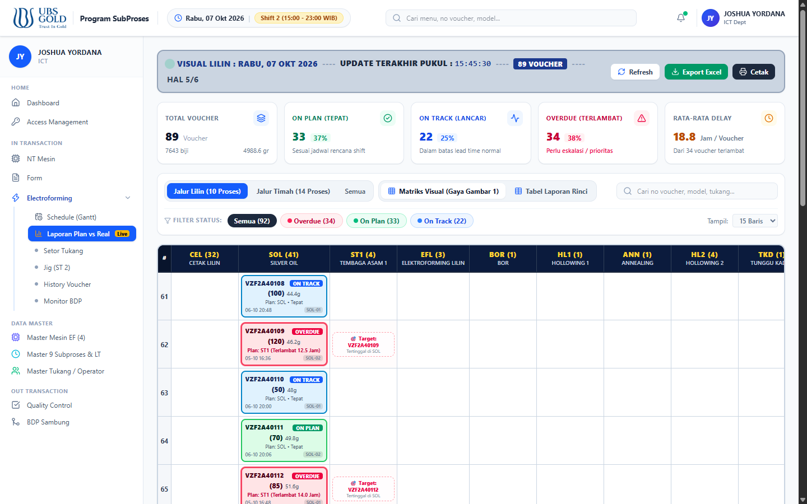
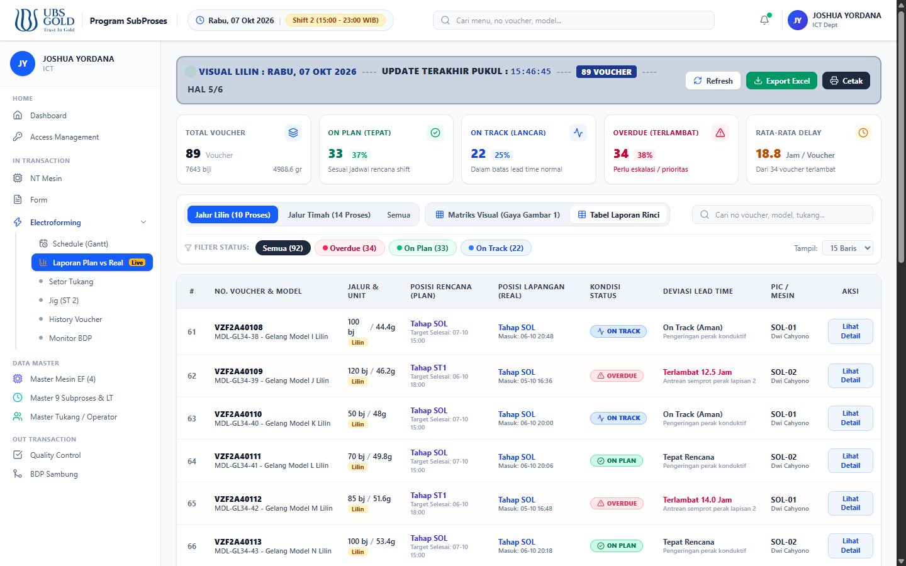
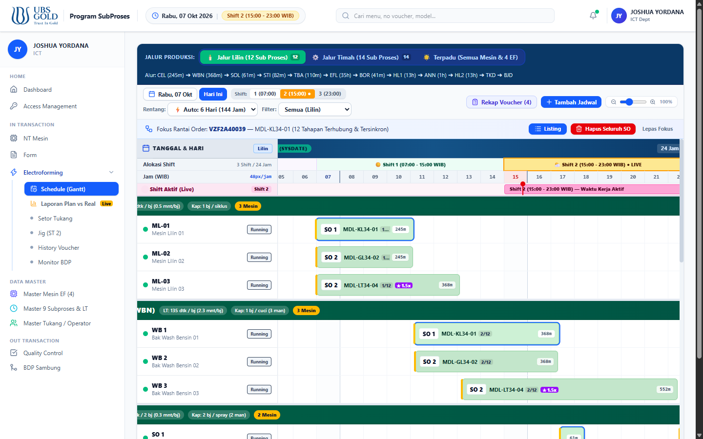

<div align="center">

# ✨ UBS GOLD — SCHEDULE & LAPORAN PLAN VS REAL ELECTROFORMING
### *Sistem Monitoring Visual & Penjadwalan Produksi Metode No. 34*

[](https://react.dev/)
[](https://vitejs.dev/)
[](https://tailwindcss.com/)
[](#-100-offline-ready--dukungan-lan)
[](#-implementasi-metode-produksi-no-34)

<br/>

> **Sistem terintegrasi untuk perencanaan jadwal (*Plan*) dan monitoring pelaporan lapangan (*Real*) produksi perhiasan emas Electroforming UBS Gold. Dilengkapi dengan Visual Matrix Board real-time, Gantt Chart timeline multi-tahap, pelacakan deviasi lead time, serta dukungan jaringan lokal tanpa ketergantungan internet.**

</div>

---

## 📸 Galeri Tampilan Sistem

### 1. 📊 Laporan Plan vs Real — Matriks Visual Alur (Visual Board)
> *Mengadopsi dan menyempurnakan struktur papan visual lantai pabrik UBS Gold menjadi antarmuka digital yang interaktif dan kaya konteks.*



**Keunggulan Tampilan Matriks:**
- **Header Banner Status**: Menampilkan identitas tanggal, jam pembaruan live, total voucher terpantau, dan halaman aktif (misal `HAL 5/6`).
- **Kolom Alur Subproses**: Header kolom horizontal (`CEL`, `SOL`, `ST1`, `EFL`, `BOR`, `HL1`, `ANN`, `HL2`, `TKD`, `BJD`) lengkap dengan counter voucher aktif di setiap stasiun.
- **Kartu Voucher Berwarna (Color-Coded Cards)**:
  - 🔴 **OVERDUE (Merah / Rose)**: Menandai keterlambatan posisi fisik atau durasi proses yang melampaui toleransi jadwal target.
  - 🟢 **ON PLAN (Hijau / Emerald)**: Posisi voucher tepat berada di subproses rencana pada jam kerja berjalan (0 deviasi).
  - 🔵 **ON TRACK (Biru / Cyan)**: Progres aktif berjalan lancar dalam batas waktu siklus normal.
- **Ghost Target Indicator (`🎯`)**: Menampilkan penanda putus-putus pada kolom tujuan yang seharusnya jika sebuah voucher tertinggal di stasiun sebelumnya.

---

### 2. 📋 Laporan Plan vs Real — Tabel Analisis Rinci
> *Format tabular komprehensif untuk evaluasi manajerial, audit shift, dan analisis deviasi waktu per voucher.*



**Fitur Tabel Rinci:**
- Komparasi unit: **Plan Biji vs Real Biji** dan **Plan Berat (gr) vs Real Berat (gr)**.
- Kolom posisi: **Posisi Rencana (Plan)** vs **Posisi Lapangan (Real)** beserta jam masuk riil.
- Kolom deviasi lead time otomatis beserta alasan kendala di stasiun kerja.
- Identifikasi PIC Tukang / Operator dan nomor mesin yang sedang menangani.
- Tombol **Lihat Detail** untuk membuka modal drill-down step-by-step per subproses.

---

### 3. ⏱️ Timeline Gantt Chart Penjadwalan (Metode No. 34)
> *Penjadwalan interaktif end-to-end multi-tahap dengan pembagian shift kerja, alokasi mesin presisi, dan deteksi bentrok batch.*



**Kemampuan Gantt Timeline:**
- Visualisasi rentang waktu berdasar shift kerja (Shift 1: 07:00–15:00, Shift 2: 15:00–23:00, Shift 3: 23:00–07:00).
- Penjadwalan berantai otomatis (*auto-cascade*) dari proses awal cetak hingga pelepasan jig & finishing.
- Fleksibilitas mesin lilin (`ML-01`, `ML-02`, `ML-03`), mesin timah (`MT-01`), dan 4 bath utama electroforming (`EF-01` s/d `EF-04`).
- Dukungan buffer jeda setup 5 menit antar produk dan alokasi 1 model spesifik per mesin.

---

## 🎯 Fitur-Fitur Utama

### 🚦 Klasifikasi Kondisi Plan vs Real
| Status | Aksen Warna | Kriteria Logika |
| :--- | :--- | :--- |
| **OVERDUE** | 🔴 **Merah / Rose** | Voucher mengalami keterlambatan: tahap fisik tertinggal dari target jadwal shift, atau pengerjaan melebihi batas lead time standar. |
| **ON PLAN** | 🟢 **Hijau / Emerald** | Voucher berada tepat di tahap yang direncanakan pada jam tersebut dan berjalan sesuai durasi standar. |
| **ON TRACK** | 🔵 **Biru / Indigo** | Voucher sedang aktif diproses dalam batas toleransi normal dan diproyeksikan selesai tepat waktu. |

### 🔄 Alur Pipeline Produksi
1. **Jalur Lilin (12 Subproses)**:
   $$\text{CEL} \rightarrow \text{WBN} \rightarrow \text{SOL} \rightarrow \text{STI} \rightarrow \text{TBA} \rightarrow \text{EFL (35h)} \rightarrow \text{BOR} \rightarrow \text{HL1} \rightarrow \text{ANN} \rightarrow \text{HL2} \rightarrow \text{TKD} \rightarrow \text{BJD}$$
2. **Jalur Timah (14 Subproses)**:
   $$\text{CET} \rightarrow \text{AMP} \rightarrow \text{GLD} \rightarrow \text{ULR} \rightarrow \text{STB} \rightarrow \text{ST1} \rightarrow \text{EFT (35h)} \rightarrow \text{ST2} \rightarrow \text{BOR} \rightarrow \text{OVN} \rightarrow \text{HL1} \rightarrow \text{ANN} \rightarrow \text{TKD} \rightarrow \text{BJD}$$

### 🌊 Mesin Floating EF-03
Mesin **EF-03** dirancang fleksibel dapat dialokasikan dinamis antara Jalur Lilin maupun Jalur Timah untuk menyeimbangkan beban antrean (*load-balancing*).

### ⚡ 100% Offline-Ready & Dukungan LAN
- **Zero External CDN**: Seluruh styling dikompilasi menggunakan **Tailwind CSS v4** lokal tanpa dependensi koneksi internet luar.
- **Akses Jaringan Lokal (Host 0.0.0.0)**: Siap diakses bersama oleh supervisor dan staf produksi melalui kabel LAN atau Wi-Fi kantor.
- **Fitur Ekspor**: Tombol **Export Excel (CSV)** dan tombol cetak siap pakai.

---

## 🚀 Panduan Memulai (Getting Started)

### Prasyarat
- [Node.js](https://nodejs.org/) versi 18.0 atau lebih baru.
- Web Browser modern (Google Chrome, Microsoft Edge, Mozilla Firefox).

### 1. Clone Repository
```bash
git clone https://github.com/BayDKen/schedule-electroforming.git
cd schedule-electroforming
```

### 2. Pasang Dependensi
```bash
npm install
```

### 3. Jalankan Aplikasi
```bash
npm run dev
```

Aplikasi akan berjalan dan dapat diakses di browser:
- **Akses Lokal**: `http://localhost:5173`
- **Akses Rekan Kerja (LAN / Wi-Fi)**: `http://<IP-Komputer-Anda>:5173`

### 4. Build untuk Produksi
```bash
npm run build
```
Hasil kompilasi siap disajikan dari folder `dist/`.

---

## 📁 Struktur Direktori

```plaintext
schedule-electroforming/
├── docs/
│   └── screenshots/                   # Tangkapan layar antarmuka aplikasi
│       ├── plan-vs-real-matrix.png    # Screenshot Mode Matriks Visual
│       ├── plan-vs-real-table.png     # Screenshot Mode Tabel Analisis
│       └── schedule-timeline.png      # Screenshot Gantt Timeline
├── public/
│   └── ubs-logo-blue.png              # Aset logo resmi UBS Gold
├── src/
│   ├── components/
│   │   ├── DetailVoucherPlanRealModal.jsx  # Modal drilldown per voucher
│   │   ├── LaporanPlanReal.jsx             # Komponen utama laporan Plan vs Real
│   │   ├── ScheduleTimeline.jsx            # Komponen Gantt chart timeline
│   │   ├── SubprosesForm.jsx               # Form setor tukang & transaksi
│   │   ├── Sidebar.jsx                     # Navigasi sidebar sistem
│   │   └── Header.jsx                      # Header brand UBS & real-time shift
│   ├── data/
│   │   └── initialData.js             # Data master mesin, operator, dan proses
│   ├── utils/
│   │   ├── dateUtils.js               # Kalkulasi shift & waktu kerja
│   │   ├── pipelineUtils.js           # Mesin penjadwalan rantai tahapan
│   │   └── planRealUtils.js           # Logika Plan vs Real & export CSV
│   ├── App.jsx                        # Komponen root aplikasi & router
│   ├── index.css                      # Konfigurasi Tailwind CSS v4 lokal
│   └── main.jsx                       # Entry point aplikasi React
├── package.json
├── vite.config.js                     # Konfigurasi Vite & Tailwind plugin
└── README.md
```

---

## 🛠️ Teknologi yang Digunakan

- **Frontend**: [React 19](https://react.dev/), [Vite 6](https://vitejs.dev/)
- **Styling**: [Tailwind CSS v4](https://tailwindcss.com/) (Local Compiler Plugin)
- **Ikonografi**: [Lucide React](https://lucide.dev/)
- **Metodologi**: Standar Penjadwalan Produksi No. 34 UBS Gold

---

<div align="center">
  <sub>Dikembangkan untuk Departemen Electroforming • PT Untung Bersama Sejahtera (UBS Gold)</sub>
</div>
